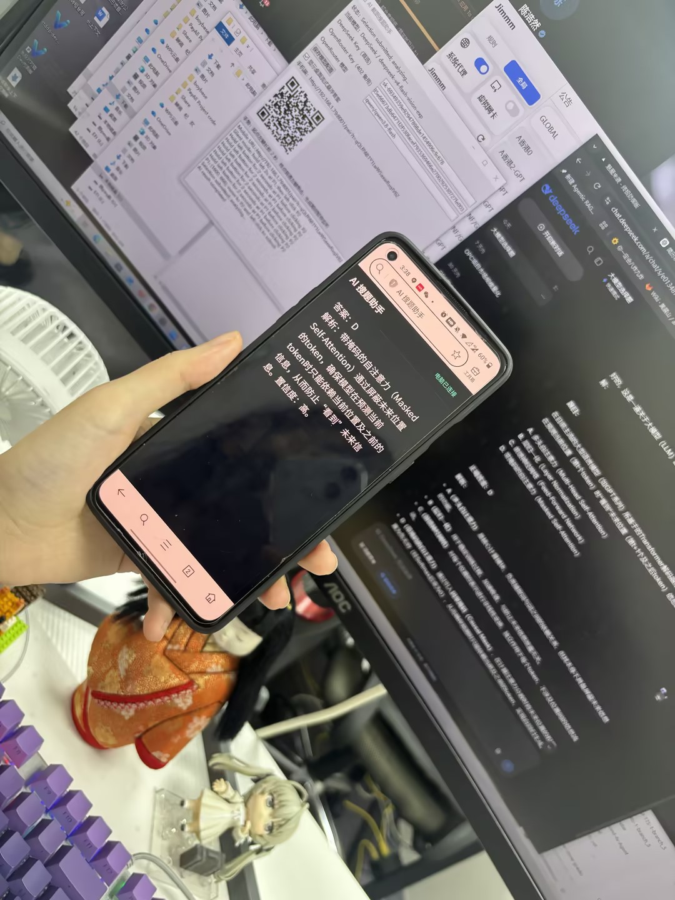
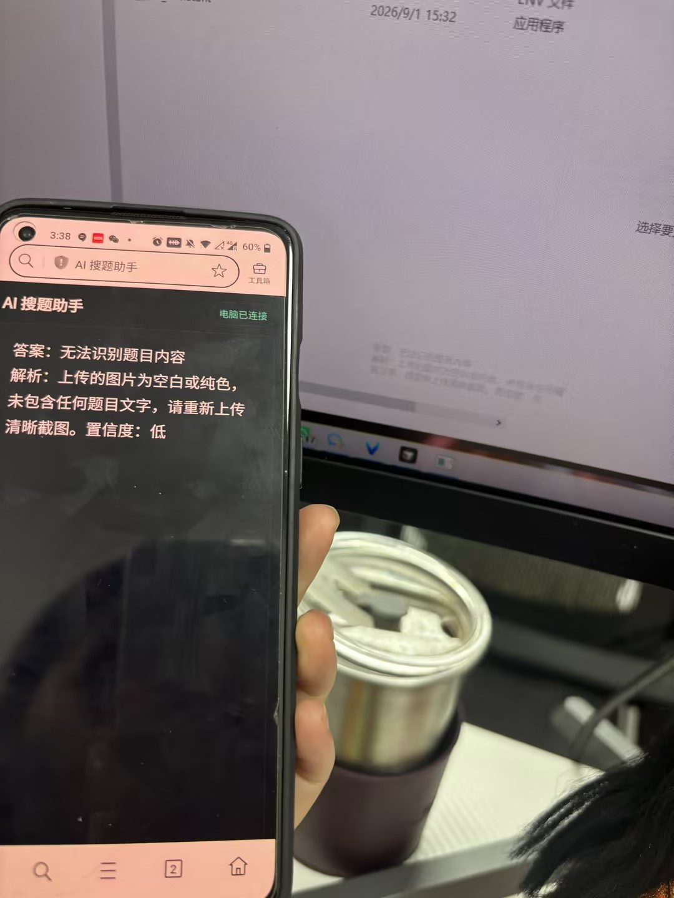

# AutoAIAnswer

Windows / macOS 截图搜题助手。通过全局鼠标手势框选屏幕题目，调用视觉模型分析，并把答案实时流式发送到同一局域网内的手机浏览器；也可选择在桌面显示轻量透明悬浮答案。

## 直接下载

[下载 Windows 单文件版 AI_Assistant.exe](https://github.com/SAYURIqvq/AutoAIAnswer/releases/latest/download/AI_Assistant.exe)

[下载 macOS 版 AutoAIAnswer-macOS.dmg](https://github.com/SAYURIqvq/AutoAIAnswer/releases/latest/download/AutoAIAnswer-macOS.dmg)

无需安装 Python，下载对应系统版本后直接运行，并在软件界面中填写自己的 DeepSeek/OpenRouter API Key。公开发行版不包含作者的 API Key。

### 在 GitHub 页面中找到下载文件

1. 在仓库首页右侧找到 **Releases**。
2. 点击最新版本 **AutoAIAnswer v0.1.0**。
3. 进入发布页面后展开 **Assets**。
4. Windows 点击 **AI_Assistant.exe**；macOS 点击 **AutoAIAnswer-macOS.dmg**。

如果没有看到右侧栏，也可以直接点击上方的“下载 Windows 单文件版”链接，或打开 [Releases 页面](https://github.com/SAYURIqvq/AutoAIAnswer/releases/latest)。

## 核心体验

### 手机端实时查看

电脑完成框选后，模型返回的内容会立即逐段推送到手机浏览器，无需等待完整答案生成。手机端只保留一个清晰的输出区域，答案和解析连续显示，适合把电脑屏幕留给当前工作。

<table>
  <tr>
    <td width="50%"></td>
    <td width="50%"></td>
  </tr>
  <tr>
    <td align="center">手机与电脑配合，实时查看模型答案</td>
    <td align="center">电脑透明水印可以拖动调整透明度和大小</td>
  </tr>
</table>

### 轻量透明悬浮答案（水印效果）

桌面端可开启类似歌词或水印的答案悬浮层：文字小巧、低透明、始终置顶，并可拖动到任意位置。模型生成时内容会同步流式追加，不需要切换窗口。悬浮层默认关闭，可随时在主窗口中开启或隐藏，并自动记住上次位置。

> 悬浮答案是普通系统置顶窗口，可能出现在屏幕共享或录制画面中；本项目不提供规避录屏、共享屏幕或监控检测的功能。

## 功能

- 支持选择题、判断题、填空题、计算题和简答题
- DeepSeek 与 OpenRouter 双提供商配置
- 每次启动优先使用 DeepSeek；DeepSeek 返回 HTTP 402 时自动切换 OpenRouter
- OpenRouter 默认模型为 `qwen/qwen3.8-flash`，模型 ID 可修改
- DeepSeek Key、OpenRouter Key 和模型设置可在桌面界面保存
- 手机二维码配对，答案与解析在单一输出框中实时流式显示
- 11px、约 18% 不透明度的水印式桌面悬浮答案，可拖动、置顶并记忆位置
- 模型生成期间暂停鼠标手势，避免误触

## 使用方式

1. 启动程序，填写并保存 DeepSeek Key、OpenRouter Key 和 OpenRouter 模型。
2. 确保手机与电脑连接同一局域网。
3. 用手机扫描桌面窗口中的二维码并保持页面打开。
4. 在题目区域起点按住鼠标左键至少 2 秒，松开后移动到区域终点，再普通单击一次左键。
5. 程序截图并分析，答案会实时显示在手机端；若开启悬浮答案，也会同步显示在桌面。

Windows 首次运行可能询问防火墙权限，请允许程序访问“专用网络”，否则手机可能无法连接电脑的 8000 端口。

### macOS 首次运行

1. 打开 DMG，将 `AutoAIAnswer.app` 拖入“应用程序”。
2. 由于当前版本未使用 Apple Developer ID 签名，首次打开请在 Finder 中右键应用并选择“打开”。
3. 根据系统提示，在“系统设置 → 隐私与安全性”中允许 **辅助功能**（监听框选手势）和 **屏幕录制**（截取题目区域）。
4. 授权后若手势或截图仍不可用，请完全退出应用后重新打开。

## 模型切换规则

- 软件启动后首先使用 DeepSeek 官方接口与视觉模型。
- 只有 DeepSeek 返回 HTTP 402（额度不足）时，才会用同一截图重试 OpenRouter。
- 切换后，本次软件运行期间继续使用 OpenRouter；重启软件后重新从 DeepSeek 开始。
- 认证失败、限流、超时、网络错误和服务端错误不会自动切换，以免重复消耗额度。

## 从源码运行

需要 Windows 或 macOS，以及 Python 3.11 或更高版本。

```powershell
python -m venv .venv
.venv\Scripts\Activate.ps1
python -m pip install -r requirements.txt
Copy-Item .env.example .env
python main.py
```

也可以直接编辑界面中的 Key 并保存。`.env` 仅用于首次提供默认值，已被 Git 忽略。

## 配置

复制 `.env.example` 为 `.env`，按需设置：

```env
DEEPSEEK_API_KEY=
DEEPSEEK_MODEL=deepseek-v4-flash-vision-exp
DEEPSEEK_BASE_URL=https://api.deepseek.com

OPENROUTER_API_KEY=
OPENROUTER_MODEL=qwen/qwen3.8-flash
OPENROUTER_BASE_URL=https://openrouter.ai/api/v1
```

不要提交真实 API Key。桌面界面保存的设置由 Qt `QSettings` 存储在当前系统用户配置中。

## 测试

```powershell
python -m pytest tests -q
```

## 构建单文件 EXE

运行以下脚本：

```bat
build_windows_exe.bat
```

生成文件为 `dist\AI_Assistant.exe`。公开构建不会嵌入本地 `.env` 或任何 API Key；用户首次启动后在界面中填写并保存自己的 Key。仓库已忽略 `dist/`、`build/`、`.env` 和 `*.spec`。

## 安全说明

- API Key 在用户要求下以明文形式显示和保存，请只在可信电脑上使用。
- 桌面悬浮窗是普通置顶窗口，可能出现在屏幕共享或录制内容中。
- 本项目不提供规避录屏、共享屏幕或监控检测的功能。

## License

当前仓库未附带开源许可证。未经作者明确授权，不代表允许复制、修改或再分发。
